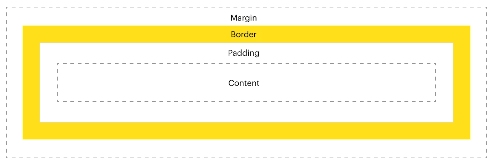

Hello! 

Visit the deployed website at https://jam-terbang.adaptable.app/main :D

Table of contents: 
- [Tugas 2](#tugas-2)
- [Tugas 3](#tugas-3)
- [Tugas 4](#tugas-4)
- [Tugas 5](#tugas-5)

--- 

### TUGAS 2

#### Jelaskan bagaimana cara kamu mengimplementasikan checklist di atas secara step-by-step (bukan hanya sekadar mengikuti tutorial)!

Awalnya, saya mengatur environment untuk memulai project Django baru. Saya membuat folder dengan virtual environment dan menginstall beberapa library yang diperlukan menggunakan `pip install`. 

Berikut ini library yang saya install:

```
django
gunicorn
whitenoise
psycopg2-binary
requests
urllib3
```
Setelah itu, saya membuat project Django baru. Saya ingin menamai inventory app pada tugas ini "Jam Terbang", jadi saya menggunakan perintah `django-admin createproject jam_terbang`. 


Kemudian saya membuat aplikasi "main" dengan menggunakan ``python manage.py createapp main``. Saya lalu mendaftarkannya pada ``settings.py`` di folder proyek pada bagian ``INSTALLED_APPS``. 

```
INSTALLED_APPS = [
    'django.contrib.admin',
    'django.contrib.auth',
    'django.contrib.contenttypes',
    'django.contrib.sessions',
    'django.contrib.messages',
    'django.contrib.staticfiles',
    'main'
]
```
Saya lalu melakukan konfigurasi routing proyek, dengan mendaftarkan aplikasi 'main' pada `urls.py` di folder proyek. Selain itu saya juga menambahkan `urls.py` dalam folder aplikasi 'main' dan menambahkan routingnya. 

Untuk mengatur tampilan pada aplikasi main, saya membuat folder `templates` dalam folder aplikasi main dan membuat tampilan page main tersebut dengan nama file `main.html`. Untuk menampilkan halaman dengan template yang sudah saya buat, saya mengatur `views.py` aplikasi main. 

```
from django.shortcuts import render

def show_main(request):
    context = {
        'nama': 'Ester Gracia',
        'kelas': 'PBP A',
    }

    return render(request, "main.html", context)
```
Saya lalu membuat model untuk database. Saya melakukannya dengan mengedit `models.py` dalam aplikasi main. Saya menambahkan model `Item` dengan field `name`, `amount`, dan `description`. 

```
from django.db import models

# Create your models here.
class Item(models.Model) : 
    name = models.CharField(max_length=255)
    amount = models.IntegerField()
    description = models.TextField()
    
```
Terakhir, saya tinggal melakukan deploy ke adaptable. Saya melakukannya dengan memilih `Python App Template` sebagai template deployment, erta `PostgreSQL` sebagai tipe basis data. Saya memasukkan `python manage.py migrate && gunicorn shopping_list.wsgi` sebagai start command. Saya kemudian memasukkan nama aplikasi sekaligus domain dan juga mencentang `HTTP Listener on PORT` lalu memulai proses deployment. 

#### Buatlah bagan yang berisi request client ke web aplikasi berbasis Django beserta responnya dan jelaskan pada bagan tersebut kaitan antara urls.py, views.py, models.py, dan berkas html!

 


#### Jelaskan mengapa kita menggunakan virtual environment? Apakah kita tetap dapat membuat aplikasi web berbasis Django tanpa menggunakan virtual environment?

Kita menggunakan virtual environment supaya tidak terjadi conflict antar 2 versi package yang berbeda di project yang berbeda. Sebenarnya tanpa virtual environment kita bisa-bisa saja membuat aplikasi web berbasis Django. Namun, tanpa virtual environment kita akan menginstall semua requirements secara global yang berpotensi menimbulkan konflik di project yang berbeda. Dengan virtual environment, kita hanya mengistall untuk scope satu project saja jadi kalau ada project lain di komputer yang sama tapi ingin pakai versi yang berbeda, masih akan aman-aman saja. 

#### Jelaskan apakah itu MVC, MVT, MVVM dan perbedaan dari ketiganya!

Pada MVC (Model, View, Controller), Model berurusan dengan database, Controller mengatur routing ke View (tampilan) yang sesuai dengan request. Pada MVT (Model, View, Template), mirip seperti MVC hanya saja View MVT berperan seperti Controller MCV dan Template MVT berperan seperti View MVC. Pada MVVM (Model, View, ViewModel), terdapat ViewModel yang menghubungkan View dan Model. 

---
### TUGAS 3

#### Apa perbedaan antara form POST dan form GET dalam Django?
POST untuk mengirim data ke database, sementara GET untuk mendapatkan data dari database. 

#### Apa perbedaan utama antara XML, JSON, dan HTML dalam konteks pengiriman data?

Beda formatnya, kalau XML menampilkan data dengan dibungkus oleh tag yang mendeskripsikan data tersebut sehingga bersifat *self-descriptive*, kalau JSON berbentuk *key-value* mirip seperti *dictionary* pada Python (meskipun JSON sebenernya dikirim dalam bentuk teks), kalau HTML menggunakan tag-tag struktur web seperti tag paragraf, heading, dll. 

####  Mengapa JSON sering digunakan dalam pertukaran data antara aplikasi web modern?
Karena JSON menggunkan format yang mudah dibaca oleh manusia. Selain itu, struktur JSON mirip dengan format struktur data pada berbagai bahasa pemrograman lain, misalnya dictionary Python dan object JavaScript. 

####  Jelaskan bagaimana cara kamu mengimplementasikan checklist di atas secara step-by-step (bukan hanya sekadar mengikuti tutorial).

Pertama, buat input form. Saya menambahkan fungsi add_item pada `views.py`. Saya lalu membuat file html untuk tampilannya di `main/templates`. Kemudian, saya tinggal mengatur rounting di urls.py. 

Selanjutnya, saya membuat beberapa fungsi views untuk menampilkan data. Untuk HTML, mirip dengan pada tampilan utama. Untuk sisanya, saya menggunakan serializers sesuai dengan tipe data delivery nya. Misalnya, untuk XML, menggunakan serializers XML. 

Terakhir saya menaruh routingnya di `urls.py`. Penamaannya sesuai dengan cara data deliverynya, misalnya XML bisa diakses di `/xml`, json di `/json`, dan seterusnya. 

#### Mengakses kelima URL di poin 2 menggunakan Postman, membuat screenshot dari hasil akses URL pada Postman, dan menambahkannya ke dalam README.md.


### TUGAS 4

#### Apa itu Django UserCreationForm, dan jelaskan apa kelebihan dan kekurangannya?

Django UserCreationForm adalah sistem bawaan dari Django untuk membuat user baru pada aplikasi kita. UserCreationForm mengumpulkan informasi tentang username, password, serta konfirmasi password. UserCreationForm juga sudah didukung dengan verifikasi, misalnya password harus kuat, username tidak duplikat, dan lain-lain. 

Kelebihannya adalah mudah digunakan serta integrasi yang mudah dengan fitur-fitur bawaan Django lainnya. 

Kekurangannya adalah terbatasnya field yang ditawarkan, hanya username dan password (tidak ada email dll). 

#### Apa perbedaan antara autentikasi dan otorisasi dalam konteks Django, dan mengapa keduanya penting?

Autentikasi artinya verifikasi identitas pengguna untuk memastikan bahwa pengguna itu benar-benar sesuai dengan identitas yang ia klaim. Contohnya penggunaan password mengautentikasi bahwa seseorang yang mengklaim suatu username adalah benar pemilik username tersebut. 

Otorisasi artinya penentuan akses pada pengguna  sesuai dengan ketentuan aplikasi kita. Contohnya di SCELE asdos bisa mengakses page untuk memberikan nilai tugas, tetapi mahasiswa tidak bisa. 

Keduanya penting untuk alasan keamanan dan keberlangsungan aplikasi kita. Bayangkan jika tidak ada keduanya, sistem user akan jadi kacau dan tidak berguna karena semua orang bisa mengaku-ngaku menjadi siapapun dan bisa mengakses apapun. 

#### Apa itu cookies dalam konteks aplikasi web, dan bagaimana Django menggunakan cookies untuk mengelola data sesi pengguna?

Cookies adalah sebagian kecil data yang disimpan pada browser pengguna dalam bentuk teks. Kita bisa menggunakan cookies pada aplikasi Django dengan menggunakan `response.set_cookie` untuk menyimpan data pada cookie dan `request.COOKIES` untuk mengambil data dari cookie. 

#### Apakah penggunaan cookies aman secara default dalam pengembangan web, atau apakah ada risiko potensial yang harus diwaspadai?

Jika kita mengimplementasikan cookies dengan benar maka bisa aman-aman saja. Meski demikian, ada beberapa risiko yang perlu diwaspadai yang membuat kita harus berhati-hati mengimplementasikan cookies, seperti Serangan Cross-Site Scripting (XSS) di mana penyerang menyisipkan kode berbahaya pada halaman web kita ketika cookies dikirim ke server dari browser pengguna.  

#### Jelaskan bagaimana cara kamu mengimplementasikan checklist di atas secara step-by-step (bukan hanya sekadar mengikuti tutorial).

Pertama, saya menambahkan fungsi untuk register, login, dan logout pada views.py aplikasi main. Saya menggunakan fasilitas bawaan Django untuk mempermudah membuat fungsi-fungsi tersebut yang terdapat dari `django.contrib.auth.forms`, yakni: 
- Pada fungsi register, saya memanfaatkan class `UserCreationForm`. 
- Pada fungsi login, saaya memanfaatkan fungsi `authenticate` serta `login`
- Pada fungsi logout, saya memanfaatkan fungsi `logout`

Saya lalu menghubungakan model user dengan Item, jadi setiap Item dimiliki oleh satu user. Untuk itu saya menambahkan field user pada model Item, yang berupa sebuah foreign key (menyatakan hubungan many-to-one).

Kemudian saya mengubah `main.html`. Kali ini, barang yang ditampilkan hanyalah barang milik user yang sekarang sedang logged in. Selain itu, nama yang ditampilkan adalah nama user yang logged in. 

Setelah itu, saya membuat dua akun pengguna dengan 
masing-masing tiga dummy data melalui interface aplikasi yang sudah jadi sejauh ini, diakses melalui `http://localhost:8000/`. 

Terakhir saya mengimplementasikan cookies untuk menyimpan data last logged in. Saya melakukannya dengan memanggil `response.set_cookies` setiap kali user log in untuk menyimpan kapan dia log in pada cookeis, lalu `request.COOKIES` untuk mengambil data terakhir log in. Data terakhir log in tersebut saya tampilkan juga di `main.html`. 

Untuk bonus, saya mengimplementasikannya dengan membuat views increment dan decrement untuk berurusan dengan mengubah amount suatu item pada database. Selain itu, saya menambahkan button yang mengirimkan post request ke URL yang memanggil views increment dan decrement tersebut. 

### TUGAS 5
#### Jelaskan manfaat dari setiap element selector dan kapan waktu yang tepat untuk menggunakannya.
1. Universal selector (*)
   - Memilih semua elemen dalam dokumen 
   - Tepat digunakan untuk style basic yang diterapkan di semua elemen, misalnya padding atau margin 
2. Tag selector 
   - Memilih semua elemen dengan tag tertentu dalam dokumen
   - Tepat digunakan untuk mengatur style basic semua elemen dengan suatu tag, misalnya ingin mengatur style untuk table maka kida menggunakan selector table. 
3. ID selector (#) 
   - Memilih elemen berdasarkan atribut `id`
   - Tepat digunakan ketika mengatur satu elemen khusus yang memiliki atribut `id` unik 
4. Class selector (.) 
   - Memilih elemen-elemen berdasarkan atribut `class`
   - Tepat digunakan untuk mengatur style yang sama untuk beberapa elemen dengan class yang sama
5. Atribute Selector ([attr="value"])
   - Memilih elemen berdasarkan nilai atribut tertentu 
   - Tepat digunakan ketika mau mengganti behavior elemen berdasarkan suatu atribut dan nilai
6. Pseudo-class Selector (:)
   - Memilih elemen berdasarkan keadaan atau interaksi pengguna 
   - Tepat digunakan untuk mengatur elemen berdasarkan situasi tertentu, misalnya ketika kursor berada di atas elemen (`:hover`)

#### Jelaskan HTML5 Tag yang kamu ketahui.
- Ada tag-tag yang mendefinisikan bagian dari suatu webpage seperti `<nav>`, `<header>`, `<footer>`, `<article>`, `<section>`. Elemen-elemen ini penggunaannya bisa dianggap mirip dengan `<div>` yang sintaksnya lebih *self-eplanatory*. 
- Ada elemen grafis seperti `<svg>` dan `<canvas>`. Fungsinya mirip-mirip karena sama-sama menampilkan grafis, tapi lebih lanjutnya `<svg>` biasanya untuk grafis yang lebih flat dan sederhana sementara `<canvas>` untuk yang lebih kompleks.
- Ada elemen multimedia seperti `<audio>` dan `<video>` untuk menambahkan audio dan video. 
 
#### Jelaskan perbedaan antara margin dan padding.

Padding merepresentasikan inner space dari suatu elemen (yaitu space dari tepi elemen ke dalam), sementara margin merepresentasikan space di sekitar elemen (dari tepi elemen ke luar). 

Padding bisa dimanfaatkan untuk mengubah ukuran elemen serta memberikan space antara border dan content supaya lebih enak dilihat. Margi bisa dimanfaatkan untuk mengatur posisi elemen, membuat elemen yang overlap (dengan margin negatif), serta mengatur jarak antar elemen. 



(Sumber dan gambar dari https://mailchimp.com/resources/padding-vs-margin/)

#### Jelaskan perbedaan antara framework CSS Tailwind dan Bootstrap. Kapan sebaiknya kita menggunakan Bootstrap daripada Tailwind, dan sebaliknya?

Framework Tailwind membuat kita bisa menerapkan styling dengan menggunakan class-class yang sudah didefinisikan oleh Tailwind, sehingga kita tidak perlu lagi menuliskan CSS sendiri untuk menerapkan suatu tyle. Di sisi lain, Framework Bootstrap berfokus pada penyediaan komponen-komponen jadi dengan gaya bawaan.

Kita sebaiknya menggunakan Bootstrap daripada Tailwind ketika hendak membuat website dengan cepat dan mudah tanpa terlalu memedulikan kustomisasi desain. Sebaliknya, kita lebih baik menggunakan Tailwind daripada Bootstrap ketika menginginkan berbagai website yang unik dengan kustomisasi desain sendiri.